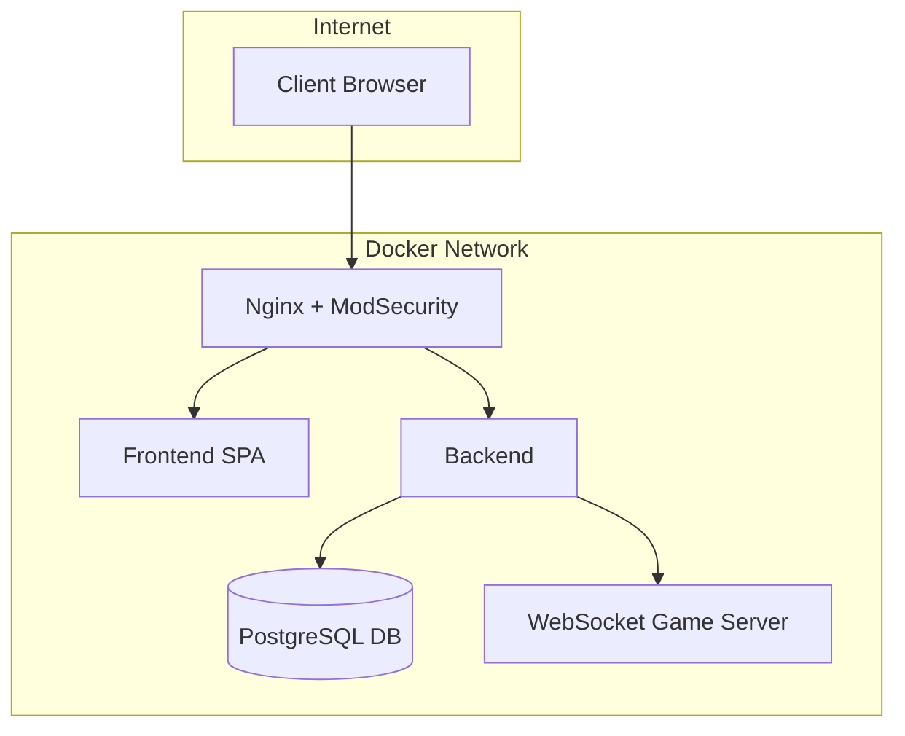

# 🏓 ft_transcendence

## 🎯 Project Overview

**ft_transcendence** is the final project of the 42 core curriculum.  
It challenges students to build a complete, full-stack web platform that combines social features with an online real-time Pong game.

The project involves:
- OAuth-based authentication (42 Intra)
- Real-time multiplayer Pong
- Social features: profiles, friends, chat
- SPA frontend with a modern framework
- Secure backend with REST and WebSocket
- PostgreSQL, Docker, Nginx, WAF (ModSecurity) /hashicorp-vault

---

## 📦 Selected Modules

## 🧩 Optional Modules (Bonus)

| Category            | Module Description                                                                                      | Level  | ✅ Selected|
|---------------------|---------------------------------------------------------------------------------------------------------|--------|------------|
| **Web**             | Use a backend framework                                                                                 | Major  | ✅         |
|                     | Use a frontend framework or toolkit                                                                     | Minor  | ⬜         |
|                     | Use a database for backend                                                                              | Minor  | ⬜         |
|                     | Store tournament scores on the Blockchain                                                               | Major  | ⬜         |
| **User Management** | Standard user management, auth, cross-tournament user support                                           | Major  | ✅         |
|                     | Implement remote authentication                                                                         | Major  | ✅         |
| **Gameplay & UX**   | Support remote players                                                                                  | Major  | ✅         |
|                     | Multiplayer (more than 2 players in-game)                                                               | Major  | ⬜         |
|                     | Add a second game with matchmaking and history                                                          | Major  | ⬜         |
|                     | Game customization options                                                                              | Minor  | ✅         |
|                     | Live chat                                                                                               | Major  | ✅         |
| **AI & Analytics**  | Implement an AI opponent                                                                                | Major  | ⬜         |
|                     | User and game statistics dashboard                                                                      | Minor  | ✅         |
| **Cybersecurity**   | WAF/ModSecurity + hardened config + Vault integration                                                   | Major  | ✅         |
|                     | GDPR compliance: anonymization, local data, account deletion                                            | Minor  | ⬜         |
|                     | Two-Factor Auth (2FA) and JWT integration                                                               | Major  | ✅         |
| **DevOps**          | Infrastructure for centralized log management                                                           | Major  | ⬜         |
|                     | Monitoring system (e.g. Prometheus/Grafana)                                                             | Minor  | ⬜         |
|                     | Backend microservices architecture                                                                      | Major  | ✅         |
| **Graphics**        | Advanced 3D graphics                                                                                    | Major  | ✅         |
| **Accessibility**   | Support for all devices                                                                                 | Minor  | ⬜         |
|                     | Browser compatibility expansion                                                                         | Minor  | ⬜         |
|                     | Multilingual support                                                                                    | Minor  | ⬜         |
|                     | Accessibility for visually impaired users                                                               | Minor  | ⬜         |
|                     | Server-Side Rendering (SSR)                                                                             | Minor  | ⬜         |
| **Server-Side Pong**| Full server-side Pong implementation + API                                                              | Major  | ⬜         |
|                     | CLI Pong vs web users through API                                                                       | Major  | ⬜         |


---

## ⚙️ Module 1: Use a Backend Framework

The backend of **ft_transcendence** is built using a modern TypeScript runtime and framework to ensure performance, scalability, and maintainability.

- **Runtime:** Node.js  
- **Framework:** Fastify  

### Why Fastify?
- High-performance HTTP server (low overhead, high throughput)
- Native support for async/await
- Built-in schema-based validation
- Easy integration with REST APIs and WebSockets
- Well-suited for microservices architectures

Fastify is used to expose secure REST endpoints, handle authentication flows, and serve as the core backend API for the application.


## 👤 Module 2: Standard User Management

This module implements a complete and secure user management system shared across the entire platform, including all tournaments and game modes.

### 👤 Authentication
- Authentication with **username and password**
- OAuth 2.0 authentication via **42 Intra Google Github**
- Secure session handling using **JWT**
- Optional **Two-Factor Authentication (OTP by Mailing, TOTP)**
- Token-based access control for protected routes

### 👤 User Accounts
- Unique user identity across the platform
- Centralized user profile (username, avatar, status)
- Account persistence across tournaments an game sessions
- Secure password handling for local credentials (hashed storage)

### 👤 Cross-Tournament Support
- A single user account is used across:
  - All tournaments
  - All game modes
  - Match history and statistics
- Consistent identity and ranking regardless of tournament context
- Global user statistics aggregated across tournaments

### 👤 Access Control
- Protected API endpoints
- Fine-grained authorization for user actions (profile update, matchmaking, chat)

This module ensures that user identity, authentication, and progression remain consistent, secure, and scalable across the entire application.


## 🔑  Module 3: Implement Remote Authentication
### 🔑 Remote Authentication via 42 Intra
- Users can log in using their **42 Intra account**
- OAuth 2.0 protocol is used to securely authenticate users
- No passwords from 42 users are stored locally
- Access token and refresh token are handled securely
- JWT is issued after successful authentication to authorize access to protected routes
### 🔑 Benefits
- ✅ Single sign-on (SSO) experience for users
- ✅ Secure authentication flow without managing sensitive passwords
- ✅ Centralized identity management across all tournaments and game modes
- ✅ Easy integration with other external services if needed

### 🔑 Flow Overview
1. User clicks “Login with 42 Intra”
2. Browser redirects to 42 OAuth authorization page
3. User approves access → 42 sends an authorization code
4. Backend exchanges code for an **access token**
5. Backend issues a **JWT** for internal API access
6. User can now access all protected routes

This module ensures that authentication is secure, standardized, and scalable, while keeping user credentials private.

## 🕹️ Module 4: Gameplay – Support Remote Players

**ft_transcendence** is designed to allow players to connect and compete in real-time, even when they are not on the same machine or network.

### 🕹️ Key Features
- **Remote multiplayer support** via WebSockets
- Players can join games from anywhere with internet access
- Real-time updates ensure minimal lag and smooth gameplay
- Player actions (paddle movements, scoring, game events) are synchronized across clients
- Automatic reconnection in case of network interruptions
- Game state is maintained on the backend to prevent cheating

### 🕹️ Technical Implementation
- **WebSocket server** handles real-time communication between clients
- Backend ensures authoritative game state
- Client-side frontend updates reflect server state in real-time
- Secure communication over **WSS (WebSocket Secure)**
- Supports multiple concurrent matches with isolated sessions

## 🎨 Module 4: Game Customization Options

**ft_transcendence** allows players to customize their Pong experience, providing flexibility and enhancing user engagement.

### 🎨 Customizable Settings
- **Ball speed** – adjust how fast the ball moves during gameplay
- **Score objective** – set the number of points required to win a match

### 🎨 Technical Implementation
- Custom settings are stored per match on the backend
- Frontend retrieves and applies settings when the match starts
- Real-time synchronization ensures both players experience the same settings
- Settings are validated on the backend to prevent unfair gameplay or exploits


## 💬 Module 5: Live Chat

**ft_transcendence** includes a simple, real-time chat system for communication between friends.

### 💬 Key Features
- **Send and receive messages** between friends
- **Live updates** powered by WebSockets
- Messages are persisted in a **dedicated chat database**
- Backend chat service is fully containerized in **Docker**
- Supports multiple concurrent chat sessions

### 💬 Technical Implementation
- Frontend connects to the **Chat WebSocket server** for instant message delivery
- Backend stores all messages in a **Dockerized database service**
- Messages can be retrieved later to maintain conversation history
- Secure communication over **WSS (WebSocket Secure)**

## 🚧 Module 6: Cybersecurity
### 🔐 – Security: Requirements
| **Security Requirement**                                                      | Status   | **Description**                                                                                                                                          |
|-------------------------------------------------------------------------------|----------|----------------------------------------------------------------------------------------------------------------------------------------------------------|
| **Password Hashing**                                                          | ✅       | Any password stored in your database must be **hashed** (e.g., using bcrypt, Argon2).                                                                   |
| **Protection Against SQL Injection and XSS**                                  | ✅       | The website must be protected against **SQL injection** and **XSS attacks** (e.g., using prepared statements and input sanitization).                   |
| **HTTPS/WSS Required**                                                        | ✅       | All communication (frontend/backend, API, WebSocket) must use **HTTPS/WSS** to ensure secure data transmission.                                        |
| **Form and Input Validation**                                                 | ✅       | You must implement **validation for all forms and user inputs**, either on the frontend (if no backend is used) or on the server side.                 |
| **Route and API Security**                                                    | ✅       | Even without implementing JWT or 2FA, all **API routes and access points must be secured**. Website security is a top priority regardless of method.   |
### 🔐 – Security: ModSecurity + Nginx
- **ModSecurity** running in a dedicated container
- Integrated **OWASP CRS**
- Attack test script implemented (SQLi, XSS, etc.)
- Nginx configured as reverse proxy serving static pages
### 🔐 – Security: HashiCorp Vault 
-  HashiCorp Vault running in a dedicated container
-  Secrets stored outside the codebase
-  Dynamic credentials for services
-  Environment variables injected securely at runtime
#### 🔐 WAF Test (ModSecurity)

⚠️ **Prerequisites**

The backend services **must be running** before executing the test script.

- Nginx + ModSecurity
- Backend API
- Any required dependencies (database, game server)

Run the attack test script:

```bash
./scripts/test_modsec.sh
```
## 🔐 Two-Factor Authentication (2FA) & JWT Integration

**ft_transcendence** implements advanced authentication mechanisms to ensure secure user sessions and protect sensitive data.

### 🔐 Two-Factor Authentication (2FA)
Users can enhance their account security with **two 2FA options**:

1. **OTP via Email**
   - One-Time Password is sent to the user's registered email
   - Required in addition to username/password or OAuth login
   - Provides an extra layer of security for account access

2. **TOTP (Time-based One-Time Password)**
   - Users can set up TOTP using an authenticator app (e.g., Google Authenticator)
   - A **QR code** is provided during setup for easy scanning
   - Generates time-sensitive codes to validate user login

### 🔐 JWT Session Management
- **Access Token**: valid for **15 minutes**
  - Used to authorize requests to protected routes
  - Short-lived to reduce risk in case of token compromise
- **Refresh Token**: valid for **7 days**
  - Allows seamless session renewal without requiring re-login
  - Stored securely and verified before issuing a new Access Token

### 🔐 Technical Implementation
- JWTs are signed with a strong secret key
- Backend validates tokens on every request to protected routes
- 2FA is enforced during login if enabled by the user
- Access and refresh tokens are used together for **secure, long-lived sessions**


## 🐳 Docker Architecture


```bash
./scripts/test_modsec.sh


## 🐳 Docker Architecture
```

