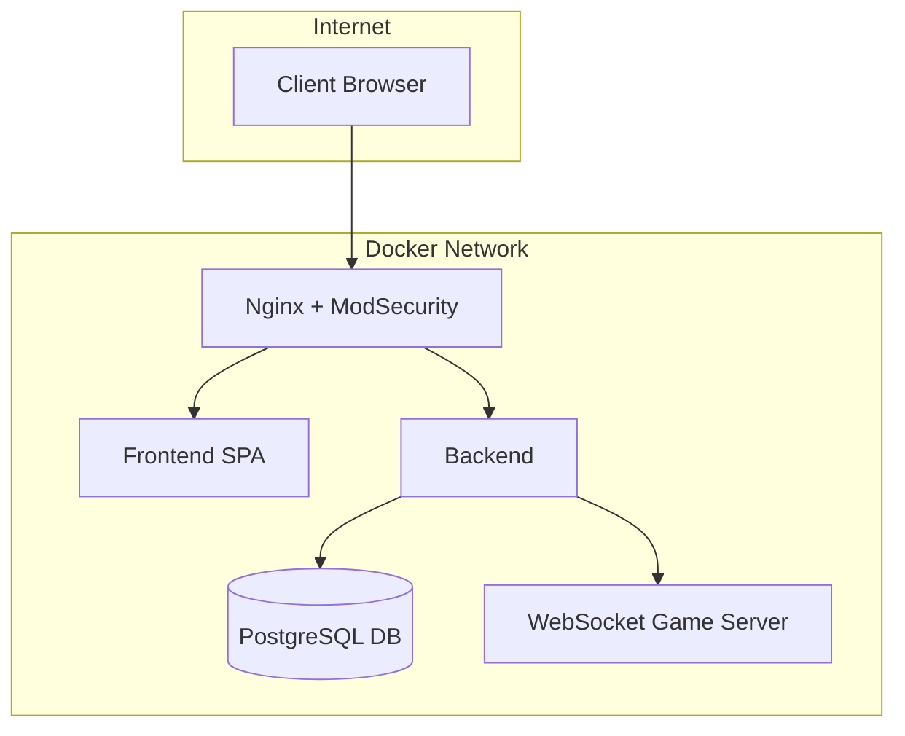

# 🏓 ft_transcendence

## 🎯 Project Overview

**ft_transcendence** is the final project of the 42 core curriculum.  
It challenges students to build a complete, full-stack web platform that combines social features with an online real-time Pong game.

The project involves:
- OAuth-based authentication (42 Intra)
- Real-time multiplayer Pong
- Social features: profiles, friends, chat
- SPA frontend with a modern framework
- Secure backend with REST and WebSocket
- PostgreSQL, Docker, Nginx, WAF (ModSecurity) /hashicorp-vault

---

## 📦 Section 1: Selected Modules

| Module                                  | Grade     | Status | Notes                             |
|-----------------------------------------|-----------|--------|-----------------------------------|
| 🔐 WAF with ModSecurity/HashiCorp Vault |Major      | ✅     | Implemented via Docker            |
| OAuth Authentication (42 API)           |           | ⬜     | Planned for backend integration   |
| User Profiles                           |           | ⬜     | Avatar, stats, history            |
| Friends System & Blocking               |           | ⬜     | Relationship management           |
| Public/Private Chat                     |           | ⬜     | Roles, mute/ban, channel types    |
| Real-Time Pong Game                     |           | ⬜     | Gameplay + WebSocket              |
| Matchmaking & Spectator Mode            |           | ⬜     | Room management                   |
| 2FA + JWT Authentication                |           | ⬜     | Planned                           |
| Monitoring (Prometheus/Grafana)         |           | ⬜     | Optional                          |

---

## 🚧 Section 2: Project Progress
### 🔐 2.0 – Security: Requirements
| **Security Requirement**                                                      | Status   | **Description**                                                                                                                                          |
|-------------------------------------------------------------------------------|----------|----------------------------------------------------------------------------------------------------------------------------------------------------------|
| **Password Hashing**                                                          | ⬜       | Any password stored in your database must be **hashed** (e.g., using bcrypt, Argon2).                                                                   |
| **Protection Against SQL Injection and XSS**                                  | ✅       | The website must be protected against **SQL injection** and **XSS attacks** (e.g., using prepared statements and input sanitization).                   |
| **HTTPS/WSS Required**                                                        | ✅       | All communication (frontend/backend, API, WebSocket) must use **HTTPS/WSS** to ensure secure data transmission.                                        |
| **Form and Input Validation**                                                 | ⬜       | You must implement **validation for all forms and user inputs**, either on the frontend (if no backend is used) or on the server side.                 |
| **Route and API Security**                                                    | ⬜       | Even without implementing JWT or 2FA, all **API routes and access points must be secured**. Website security is a top priority regardless of method.   |
### 🔐 2.1 – Security: ModSecurity + Nginx
- ✅ **ModSecurity** running in a dedicated container
- ✅ Integrated **OWASP CRS**
- ✅ Attack test script implemented (SQLi, XSS, etc.)
- ✅ Nginx configured as reverse proxy serving static pages
### 🔐 2.2 – Security: HashiCorp Vault 


## 🐳 Docker Architecture


```bash
./scripts/test_modsec.sh


## 🐳 Docker Architecture
```

