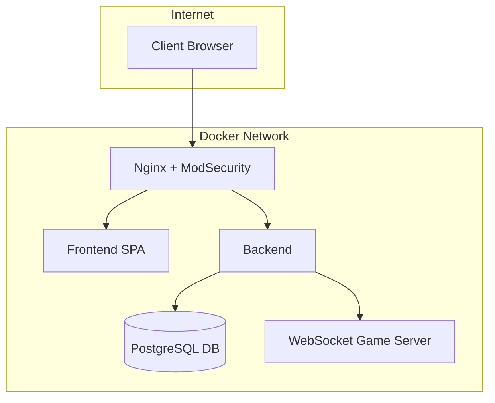

# 🏓 ft_transcendence

## 🎯 Project Overview

**ft_transcendence** is the final project of the 42 core curriculum.  
It challenges students to build a complete, full-stack web platform that combines social features with an online real-time Pong game.

The project involves:
- OAuth-based authentication (42 Intra)
- Real-time multiplayer Pong
- Social features: profiles, friends, chat
- SPA frontend with a modern framework
- Secure backend with REST and WebSocket
- PostgreSQL, Docker, Nginx, WAF (ModSecurity)

---

## 📦 Section 1: Selected Modules

| Module                             | Mandatory | Status | Notes                             |
|------------------------------------|-----------|--------|-----------------------------------|
| OAuth Authentication (42 API)      | ✅        | ⬜     | Planned for backend integration   |
| User Profiles                      | ✅        | ⬜     | Avatar, stats, history            |
| Friends System & Blocking          | ✅        | ⬜     | Relationship management           |
| Public/Private Chat                | ✅        | ⬜     | Roles, mute/ban, channel types    |
| Real-Time Pong Game                | ✅        | ⬜     | Gameplay + WebSocket              |
| Matchmaking & Spectator Mode       | ✅        | ⬜     | Room management                   |
| 🔐 WAF with ModSecurity            | | ✅    | Implemented via Docker            |
| 2FA + JWT Authentication           |  | ⬜     | Planned                           |
| Monitoring (Prometheus/Grafana)   | | ⬜     | Optional                          |

---

## 🚧 Section 2: Project Progress

### 🔐 2.1 – Security: ModSecurity + Nginx

- ✅ **ModSecurity** running in a dedicated container
- ✅ Integrated **OWASP CRS**
- ✅ Attack test script implemented (SQLi, XSS, etc.)
- ✅ Nginx configured as reverse proxy serving static pages

## 🐳 Docker Architecture


```bash
./scripts/test_modsec.sh


## 🐳 Docker Architecture
```

